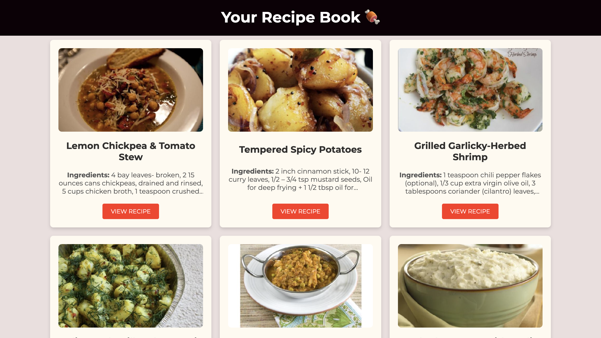

# Your Recipe Book 

This is a Recipe application built using JavaScript, HTML, and CSS. It allows users to read recipes using an API (Spoonacular API) and displays a list of recipes with their images, ingredients, and a link to view the full recipe.

## Features

- Display a list of random recipes.
- Each recipe includes an image, title, ingredients, and a link to the full recipe.
- The app fetches data from the Spoonacular API.
- Responsive design that works on both desktop and mobile devices.

## Demo
Click [here](https://skylaryhu.github.io/js-recipe-website/) to view the demo

## Screenshot

